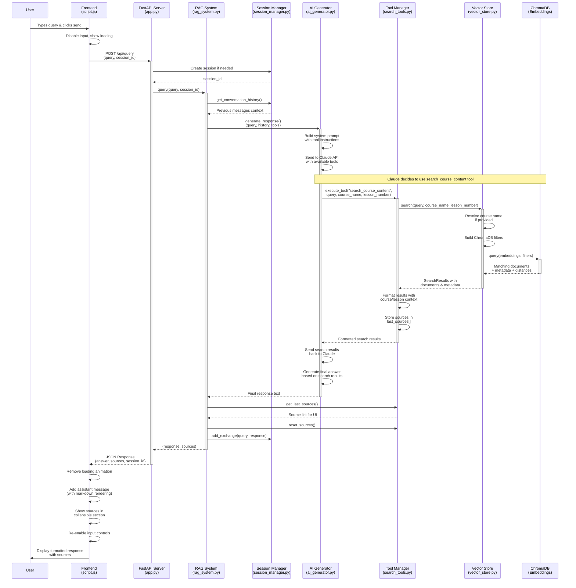
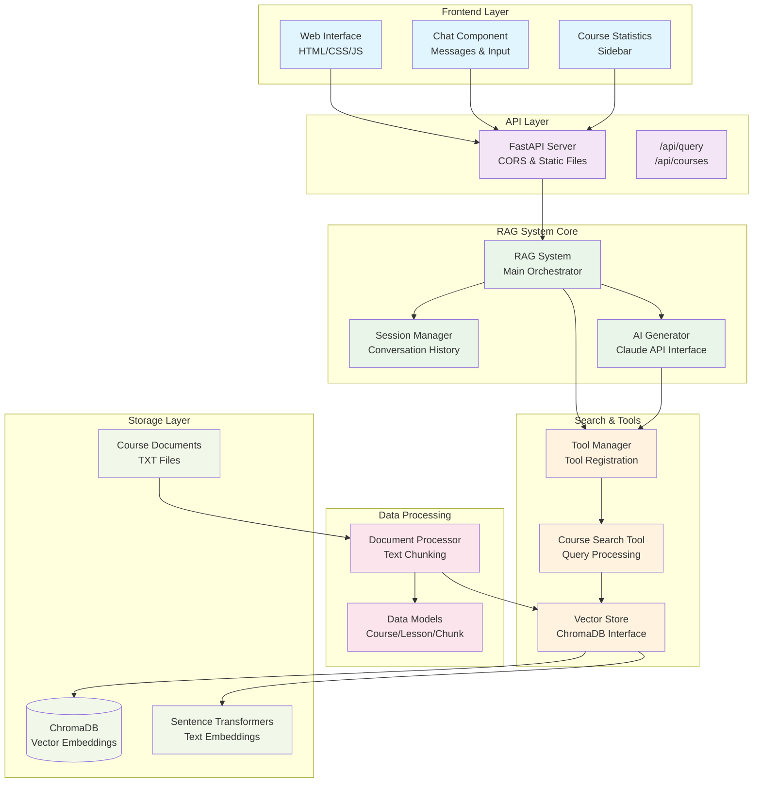

# RAG System Query Processing Flow

## Architecture Components

## Data Flow Summary

1. **User Input** → Frontend captures and validates query
2. **HTTP Request** → POST to `/api/query` with query and session
3. **Session Management** → Create/retrieve conversation context  
4. **RAG Orchestration** → Coordinate AI generation with tools
5. **AI Processing** → Claude decides whether to use search tools
6. **Tool Execution** → Search course content with filters
7. **Vector Search** → Query ChromaDB embeddings for relevant chunks
8. **Result Processing** → Format results with course/lesson context
9. **Response Generation** → Claude synthesizes final answer
10. **Source Tracking** → Collect sources for UI display
11. **Session Update** → Store Q&A exchange in conversation history
12. **Frontend Display** → Render markdown response with sources

## Key Features

- **Tool-Based Search**: AI decides when and how to search
- **Session Persistence**: Maintains conversation context
- **Smart Filtering**: Course name resolution and lesson filtering  
- **Source Attribution**: Tracks which materials were used
- **Contextual Chunking**: Preserves course/lesson context in search results
- **Markdown Rendering**: Rich text formatting in responses
- **Error Handling**: Graceful failure recovery at each layer